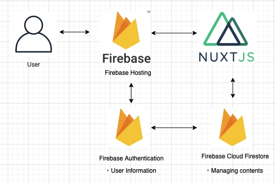

# sample-app

This is just testing Nuxt.js application's feature. Thus, backend is relying on Firebase.
A layout of this architecture is below(very simple though).

## Layout of architecture
 

will update soon...

## Build Setup

``` bash
# install dependencies
$ npm install # Or yarn install

# serve with hot reload at localhost:3000
$ npm run dev

# build for production and launch server
$ npm run build
$ npm start

# generate static project
$ npm run generate
```

For detailed explanation on how things work, checkout the [Nuxt.js docs](https://github.com/nuxt/nuxt.js).

